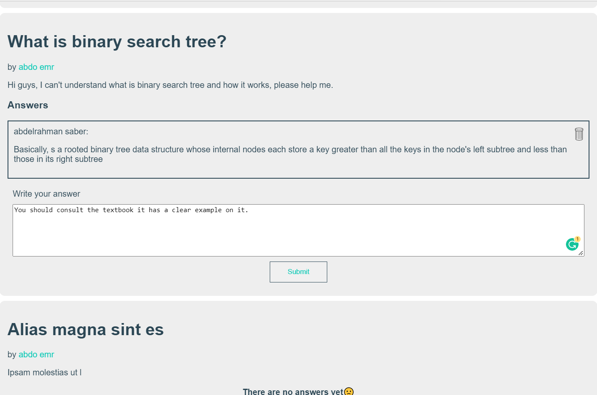

A platform where students can ask and answer questions in more organized and simple way. 
## Motivation
This project is made during MLHLateNightHack, due to Firebase limiting plan I wasn't able to upload my demo video on time. 
https://powerful-peak-21163.herokuapp.com/. 
The real idea of the project came from the previous January final exam where we wanted to collect the most potential questions and their answers, unfortunately, It turned our WhatsApp group into a nightmare of messages and replies and you had to go back and forth to get useful answers.

## Technologies
The tech stack is simple I used `React` and `react-dom-router` with `firebase` for authentication and database.

## Screenshots

## How to run
- `npm install`
- create your `.env` file with the following firebase keys: 
  - REACT_APP_FIREBASE_API_KEY
  - REACT_APP_FIREBASE_AUTH_DOMAIN
  - REACT_APP_FIREBASE_PROJECT_ID
  - REACT_APP_FIREBASE_STORAGE_BUCKET
  - REACT_APP_FIREBASE_MSG_SENDER_ID
  - REACT_APP_FIREBASE_APP_ID
- `npm start` and enjoy
  
## What to do next
-  #### Refactor the backend  
    Firebase is good but the quota exceed message is a bit annoying, The next step will be node js with mongodb and jwt authentication. 
    I should first refactor the code that deals with the backend with React to its own module so that the migration will be smooth. 
    `Backend` module now contains `getAllQuestions, getAllAnswers, submitAnswer`
- #### Group specific questions
  Right now contain a huge pile of questions, If would be better if we can arrange questions of same type or from same class into a speprate group say Physics group, Mathematics group.  
  Or more generally allow user to create group of questions and invite other users into it may be there will be passcode or even other members can ask to join this group.

- #### Interacting with answers
  like voting or replying to them. 

